<div align="center">

# 喵扑

Android 第三方虎扑赛事评分客户端

[下载应用](https://github.com/KiritoXDone/Miaopu/releases/latest) · [应用截图](#应用截图) · [问题反馈](https://github.com/KiritoXDone/Miaopu/issues)

</div>

## 简介

喵扑专注于电竞与体育赛事的赛程、选手评分和赛事讨论，涵盖英雄联盟、无畏契约、CS2、篮球、足球等项目。用户可按关注的赛事订阅内容，查看比赛结果、各局选手表现及虎扑社区讨论。

## 下载与使用

在 [Releases](https://github.com/KiritoXDone/Miaopu/releases/latest) 下载 APK，支持 **Android 7.0 及以上**版本。

赛事订阅位于 **我的 → 赛事订阅**，支持搜索、分类筛选和调整订阅顺序。首页汇总已订阅项目的比赛，赛事页提供完整赛程与搜索入口。

比赛详情可按局次和队伍查看选手表现；有全场评分或技术统计的比赛，会展示对应内容。选手详情包含评分分布和评论，评论可按最热或最新排序，支持多层回复、点赞与取消点赞。

浏览赛程、评分和评论无需登录。参与评分、发表评论、回复或点赞需在 **我的** 中登录虎扑账号。应用更新可通过 **我的 → 检查更新** 获取。

桌面提供 **2×2 单场赛况**与 **4×2 近期赛程**两种小部件，跟随应用内的赛事订阅。可在系统的小部件列表中添加，点击比赛查看详情，点击刷新按钮更新数据。

## 应用截图

<table>
  <tr>
    <th>首页 · 赛程汇总</th>
    <th>赛事 · 完整赛程</th>
    <th>赛事搜索</th>
  </tr>
  <tr>
    <td><a href="docs/screenshots/home.png">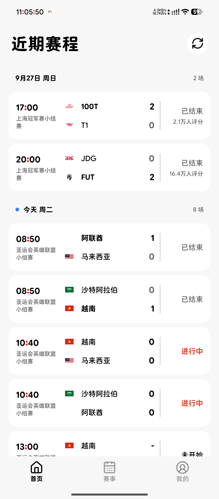</a></td>
    <td><a href="docs/screenshots/events.png">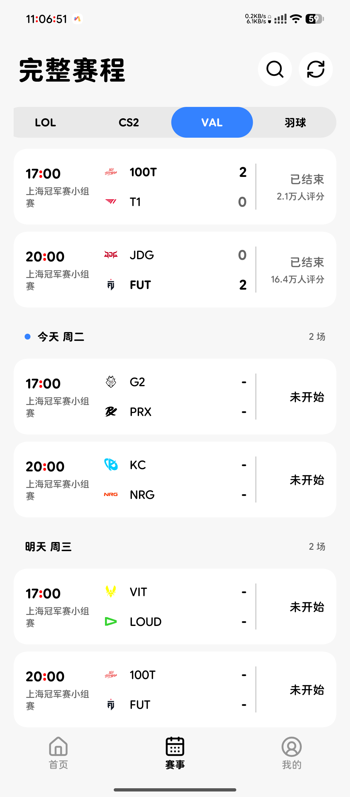</a></td>
    <td><a href="docs/screenshots/search.png">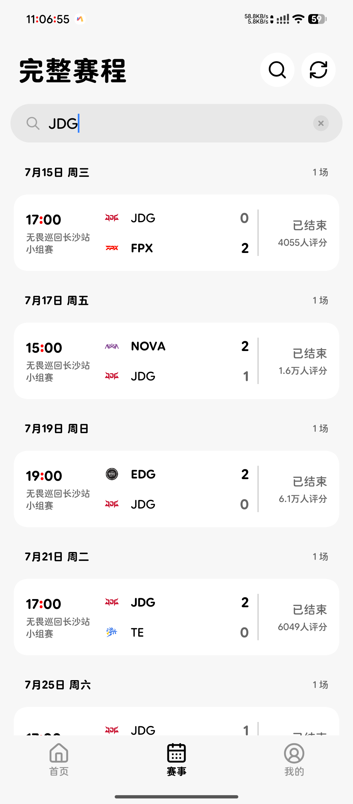</a></td>
  </tr>
  <tr>
    <th>比赛详情 · 全场评分</th>
    <th>比赛数据 · 分局统计</th>
    <th>选手评分 · 分布与评论</th>
  </tr>
  <tr>
    <td><a href="docs/screenshots/match.png">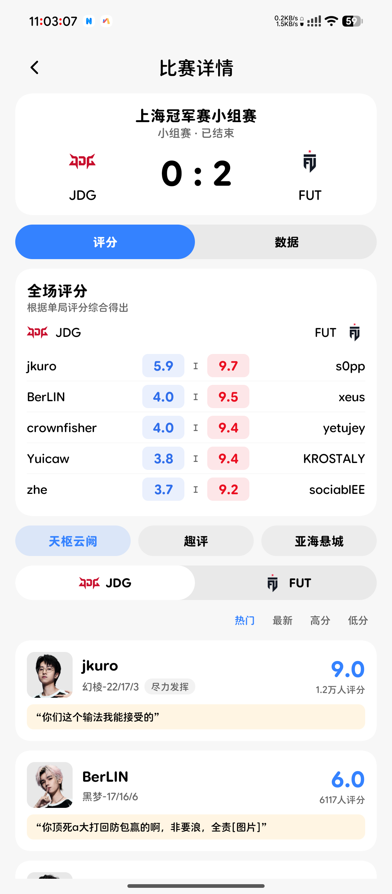</a></td>
    <td><a href="docs/screenshots/stats.png">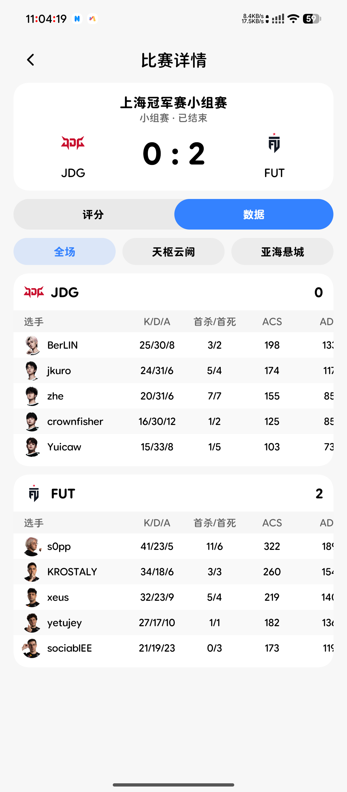</a></td>
    <td><a href="docs/screenshots/player.png">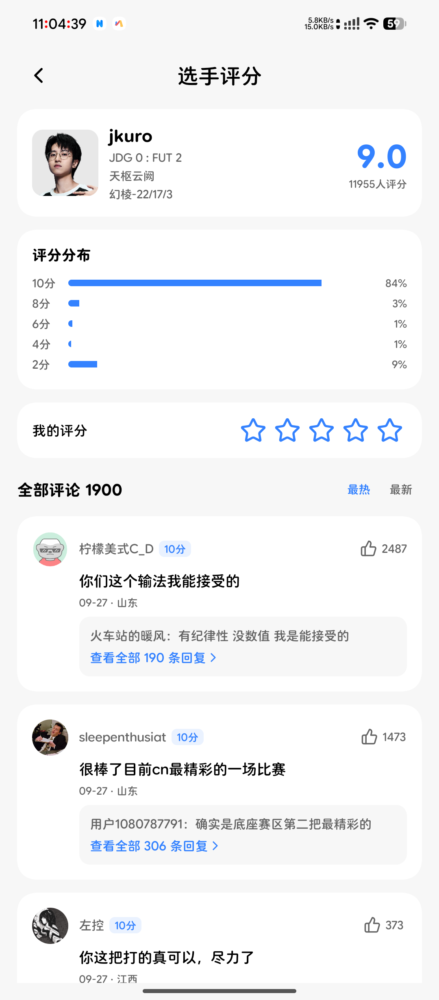</a></td>
  </tr>
  <tr>
    <th>评论 · 多层回复</th>
    <th>赛事订阅</th>
    <th>我的喵扑</th>
  </tr>
  <tr>
    <td><a href="docs/screenshots/replies.png">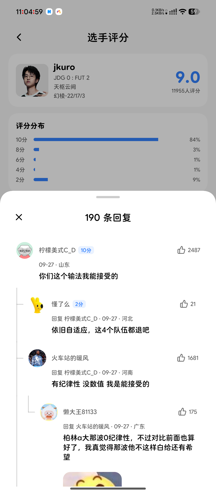</a></td>
    <td><a href="docs/screenshots/subscriptions.png">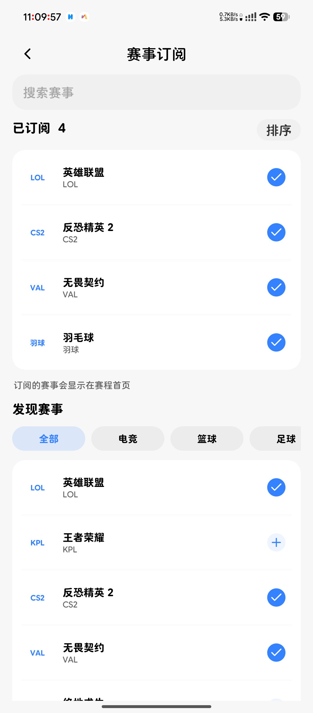</a></td>
    <td><a href="docs/screenshots/profile.png">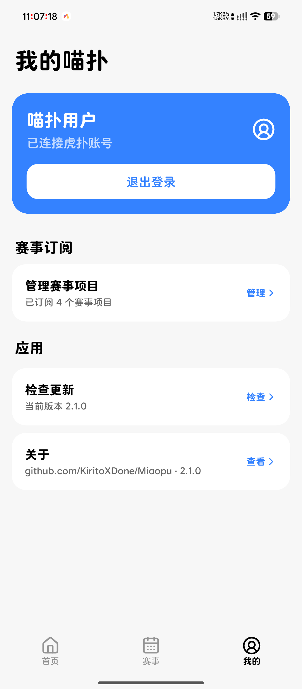</a></td>
  </tr>
</table>

<details>
  <summary>查看回复输入界面</summary>
  <p>点击具体评论可打开回复输入区，引用原评论并唤起键盘。</p>
  <a href="docs/screenshots/compose.png">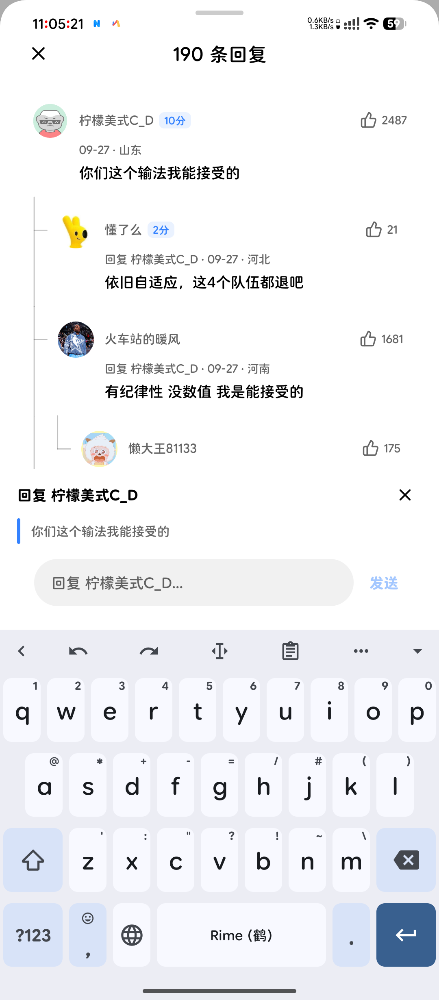</a>
</details>

### 桌面小部件

<table>
  <tr>
    <th>4×2 · 近期赛程</th>
    <th>2×2 · 单场赛况</th>
  </tr>
  <tr>
    <td><a href="docs/screenshots/widget-4x2.png">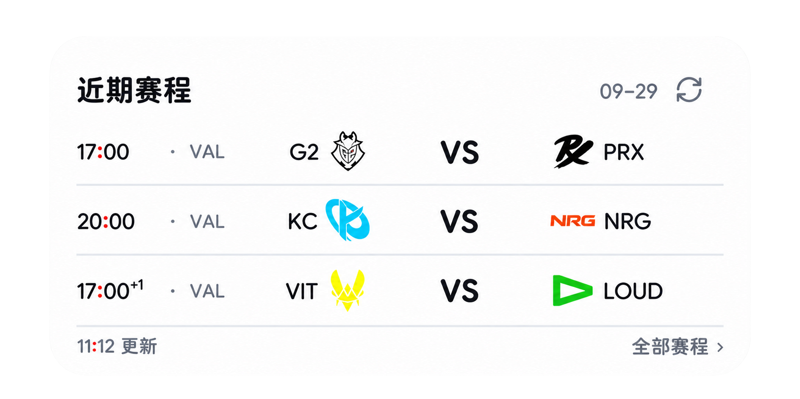</a></td>
    <td><a href="docs/screenshots/widget-2x2.png">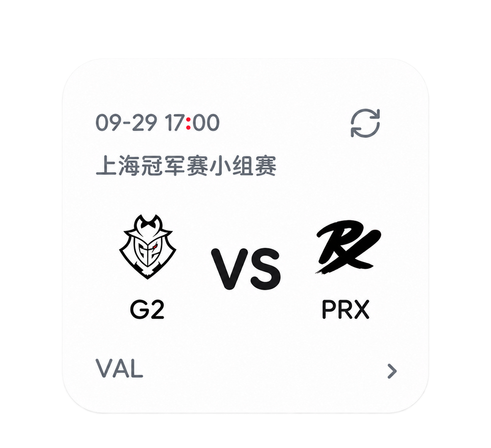</a></td>
  </tr>
</table>

## 反馈与贡献

问题反馈和功能建议请提交至 [Issues](https://github.com/KiritoXDone/Miaopu/issues)。问题报告请附上应用版本、Android 版本、相关赛事及复现步骤，必要时提供截图，并隐去个人信息。

欢迎通过 Pull Request 参与项目。较大的改动建议先通过 Issue 讨论。

## 本地构建

项目使用 Kotlin、Jetpack Compose 和 Miuix。构建环境需要 JDK 21、Android SDK 37 与 Build Tools 37.0.0。

```bash
git clone https://github.com/KiritoXDone/Miaopu.git
cd Miaopu
./gradlew testDebugUnitTest assembleDebug
```

测试版 APK 位于 `app/build/outputs/apk/debug/app-debug.apk`，应用名称为“喵扑测试版”，可与正式版共存。

## 致谢

感谢虎扑及其社区用户提供的赛事内容与讨论，以及 Miuix、Jetpack Compose、Coil 等开源项目。

感谢 [LINUX DO](https://linux.do/) 社区的交流与分享。

## 开源协议

Copyright (c) 2026 KiritoXDone

本项目原创代码采用 [GNU General Public License v3.0](LICENSE)（`GPL-3.0-only`）授权。

第三方依赖遵循各自的许可证。虎扑赛事数据、用户评论，以及截图中的头像、队标等第三方内容不属于本项目的授权范围，其权利归各自权利人所有。

## 声明

喵扑是独立的第三方项目，与虎扑官方无隶属关系。赛事、评分与评论内容归其各自权利人所有。
